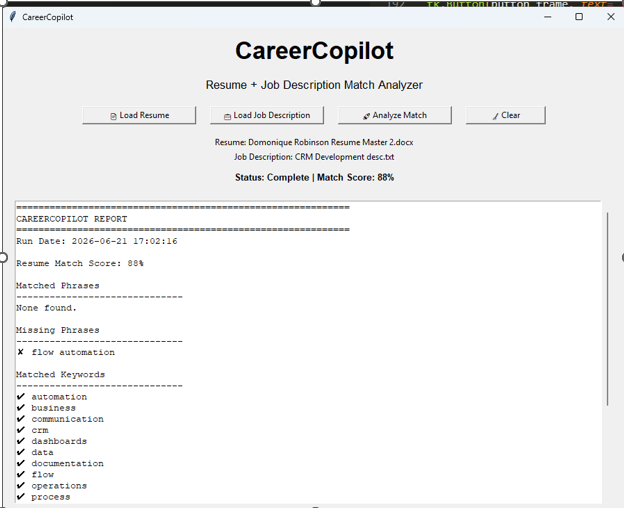
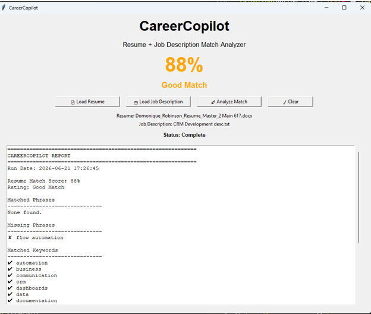
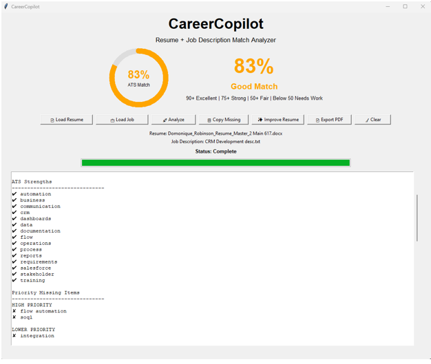

# CareerCopilot

CareerCopilot is a Python desktop application that analyzes resumes against job descriptions, calculates an ATS-style match score, identifies missing skills and keywords, generates actionable resume improvement suggestions, and exports recruiter-friendly reports.

## Why I Built This

I built CareerCopilot to support my job search while strengthening my Python, automation, and business analysis skills. The goal was to reduce the manual work of reviewing job descriptions and make resume tailoring more focused, repeatable, and data-informed.

## Key Highlights

- Desktop GUI built with Python and Tkinter
- Supports TXT, DOCX, and PDF resume/job description uploads
- ATS-style scoring engine with visual gauge
- Prioritized missing skills analysis
- Resume improvement recommendations
- One-click report export
- Standalone Windows executable (.exe)
## Features

* Upload resume files in `.txt`, `.docx`, or `.pdf` format
* Upload job descriptions in `.txt`, `.docx`, or `.pdf` format
* Calculate an ATS-style match score
* Display a visual score gauge
* Identify matched keywords and phrases
* Identify missing keywords and phrases
* Prioritize missing skills by importance
* Generate resume improvement suggestions
* Copy missing keywords to clipboard
* Copy the full report to clipboard
* Export recruiter reports
* Generate ATS-friendly analysis summaries
* Open the reports folder directly from the app
* Package the app as a standalone Windows `.exe`

## Tools Used

* Python
* Tkinter
* python-docx
* PyPDF2
* ReportLab
* PyInstaller
* VS Code
* Git/GitHub

## Skills Demonstrated

* Python scripting
* GUI application development
* File handling
* PDF and Word document parsing
* Text analysis
* Keyword matching
* Report generation
* Desktop app packaging
* Career workflow automation
* Business problem solving

## Architecture

CareerCopilot follows a simple desktop application architecture:

User
   ↓
Tkinter GUI
   ↓
File Parser
(TXT / DOCX / PDF)
   ↓
Keyword & Phrase Analyzer
   ↓
ATS Scoring Engine
   ↓
Recommendation Generator
   ↓
Report Generator
   ↓
TXT / PDF Export

### Home Screen

---

### Analysis Results

---

### Generated Report

## How It Works

1. Load a resume.
2. Load a job description.
3. Click **Analyze**.
4. CareerCopilot compares the resume to the job description.
5. The app generates a match score, missing skills, strengths, and improvement suggestions.
6. The report can be copied, exported, or saved as a PDF.

## Project Status

Version 1 is complete. Future enhancements may include:

* JobRadar companion app for job alert monitoring
* Gmail job alert parsing
* AI-assisted resume bullet suggestions
* STAR interview story generator
* Cover letter generator
* Job tracker integration
* More advanced scoring logic
* Dark mode UI

## Future Companion App: JobRadar

JobRadar will help collect job alerts from email, remove duplicates, organize roles into one tracker, and send high-fit job descriptions into CareerCopilot for scoring.

## Resume Bullet

Built CareerCopilot, a Python desktop application that analyzes resumes against job descriptions using an ATS-style scoring engine, supports TXT/DOCX/PDF parsing, identifies missing skills and keywords, generates resume improvement recommendations, and exports recruiter-ready reports while automating parts of the job search workflow.
